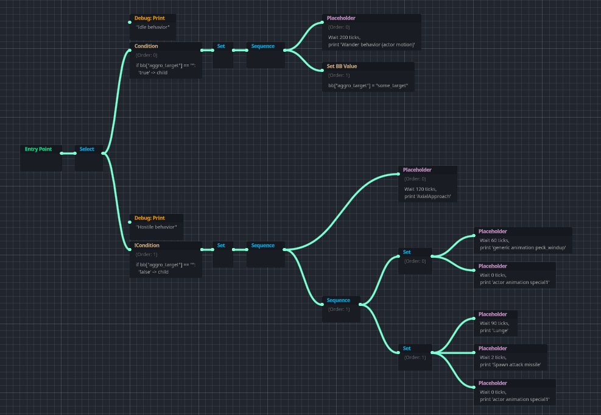

# BehBeh Trees
A flavor of Behavior Trees for Godot 4 featuring a GraphEdit-based editor.

### TLDR
- BehTrees contain BehNodes. Both are Resources.
- tick() BehTrees.
  - `fn tick(dt: float, bb: Dictionary) -> BehConst.Status`
  - It takes a delta-time "dt" and arbitrary-purpose blackboard "bb". Returns Busy, Resolved, or Failed.
  - e.g.: Call tick() in a Node's _process.
- To create custom behavior, define your own BehNode implementations. BehNode is a _Resource_ type. **New BehNodes MUST be `@tool`!**
  - There are a handful of useful built-in impls, and a template txt for new BehNodes in the addon folder.
  - **New BehNodes MUST be `@tool`!** This is due to editor limitations and the decision to reduce boilerplate, `BehNode` features overrideable methods to define how it looks in the BehTree Editor.

### Version 1.0 possibly-surprising limitations:
  - **Do not share tree references across multiple Node runners** and expect sensible behavior.
    - `bb` is supposed to be the sole source of state, but this is not true in reality currently, due to Select / Sequence node impls.
